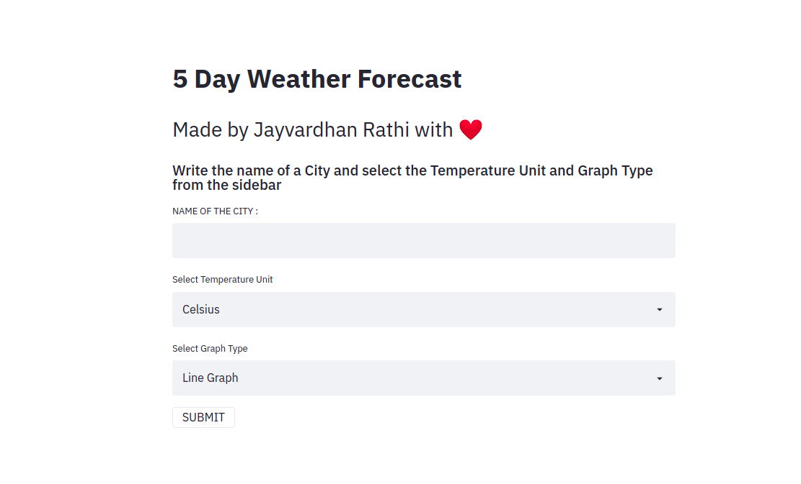
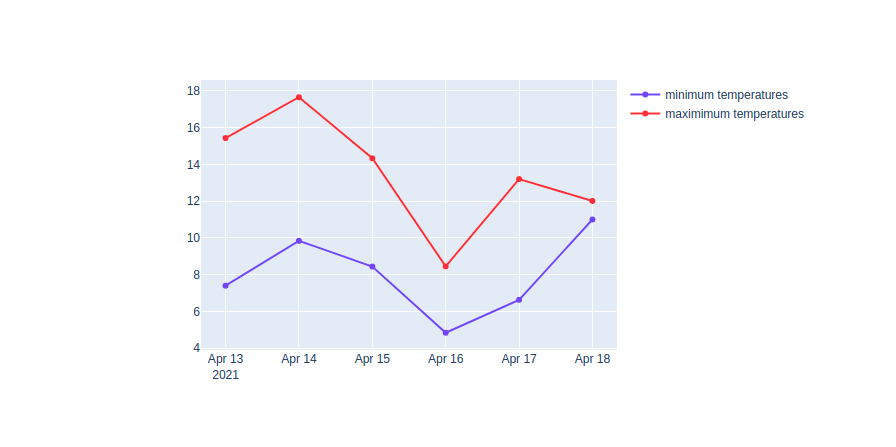
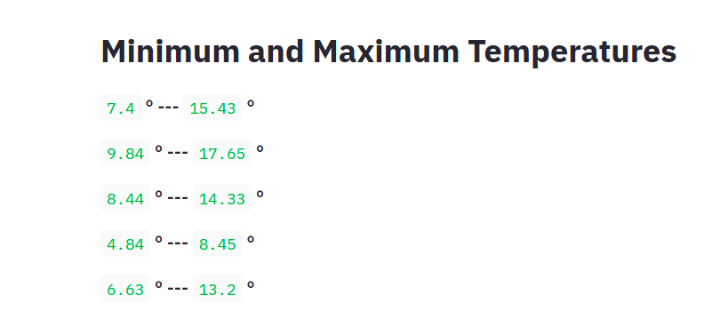
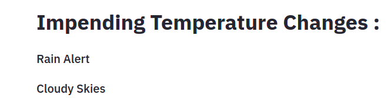
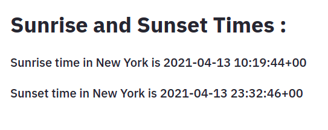

    
    
<h2 align="center">Weather app heroku</h2>
<h4 align="center">A web application to display weather updates<h4>

---

Its live - [Weather-App](https://jayvardhan-weather-app.herokuapp.com/)

---

## :fire: Features

- 5 day weather forecast
- Impending Weather changes
- Weather Graph
- Sunrise and sunset times
- CLoud Coverage
- Wind Speed

---

## :bulb: Built Using

- Python
- Streamlit
- Plotly
- Python Open Weather Map API

---

## :iphone: Screenshots

|                                        |                                        |
| -------------------------------------- | -------------------------------------- |
|  |  |
|   |   |
|   |   |

---

## Instructions to run

Git clone this repository.

`terminal pip install -r requirements.txt `

_This installs all the dependencies on your computer using the terminal 

`python app.py`

_now your app is up and running_

---

## Contributing

If you'd like to contribute, please fork the repository and make changes as
you'd like. Pull requests are warmly welcome. Thanks alot

## :heart: Found this project interesting?

If you found this project useful, then please consider giving it a :star: on Github 
and sharing it with your friends via social media.

<!-- CONTACT -->

## :man: Project Created & Maintained By -

- **Hey guys, I'm Jayvardhan. Find out more about me** [ here](https://linkedin.com/in/rathi406)
- **Reach out to me at** [rathi406@gmail.com](rathi406@gmail.com)

<h3 align="right">Built with :heart: by Jayvardhan Rathi</h3>
