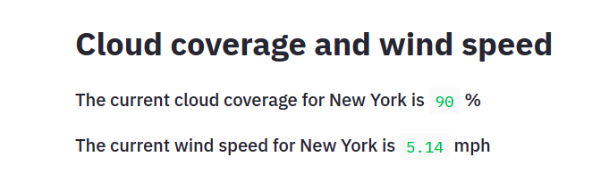

<p align="center">
    <a href="https://jayvardhanrathi.tech">
	
</a>
    
<h2 align="center">Weather app heroku</h2>
<h4 align="center">A web application to display weather updates<h4>

</p>

<h2 align="center"><a href="https://jayvardhan-weather-app.herokuapp.com/">Demo link</a> <a href="https://www.crio.do/projects/python-weather-app"/>Tutorial link</a></h2>


## :fire: Features

- 5 day weather forecast
- Impending Weather changes
- Weather Graph
- Sunrise and sunset times
- CLoud Coverage
- Wind Speed

## :bulb: Built Using

- Python
- Streamlit
- Plotly
- Python Open Weather Map API


## :iphone: Screenshots

|                                        |                                        |
| -------------------------------------- | -------------------------------------- |
|  |  |
|   |   |
|   |   |


## Instructions to run

Git clone this repository.

```pip install -r requirements.txt ```

This installs all the dependencies on your computer using the terminal 

```python app.py```

_now your app is up and running_

<!-- LICENSE -->  

## License

Distributed under the MIT License. See `LICENSE` for more information. 


<!-- CONTRIBUTING -->
## Contributing

Contributions are what make the open source community such an amazing place to be learn, inspire, and create. Any contributions you make are **greatly appreciated**.

1. Fork the Project
2. Create your Feature Branch (`git checkout -b feature/AmazingFeature`)
3. Commit your Changes (`git commit -m 'Add some AmazingFeature'`)
4. Push to the Branch (`git push origin feature/AmazingFeature`)
5. Open a Pull Request  


<!-- CONTACT -->

## :man: Project Created & Maintained By -

- **Hey guys, I'm Jayvardhan. Find out more about me** [ here](https://linkedin.com/in/rathi406)
- **Reach out to me at** [rathi406@gmail.com](rathi406@gmail.com)

<h3 align="right">Built with :heart: by Jayvardhan Rathi</h3>
